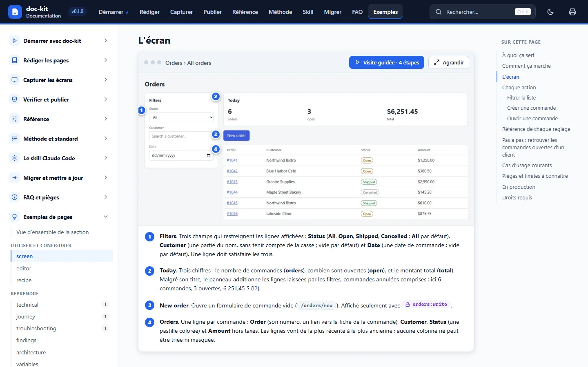
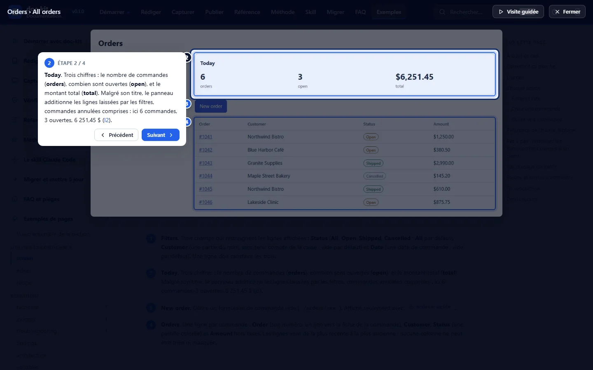

# doc-kit

**La documentation d'un produit en un seul fichier HTML autonome.** doc-kit fait d'une application web un site de
documentation qui s'ouvre hors ligne dans n'importe quel navigateur : captures annotées avec des pastilles
numérotées, visites guidées, recherche en texte intégral, glossaire, schémas, thèmes clair et sombre, et impression
du site entier. Vous écrivez du Markdown, vous décrivez les captures dans de petits plans, et le kit capture les
écrans **en lecture seule**, mesure les zones, construit le site et le contrôle.

*[English version](README.md)*



## Ce que vous obtenez

- **Un fichier HTML**, `dist/<Produit>-Documentation.html` : ni serveur, ni réseau, ni installation pour le lecteur.
  Envoyez-le, rangez-le, joignez-le.
- **Des captures annotées** : des pastilles numérotées posées sur les vrais éléments de la page, une légende, une
  **visite guidée** qui les parcourt, une visionneuse plein écran et un curseur avant / après.
- **La navigation** : sections, groupes, sous-pages, fil d'Ariane, liens précédent / suivant, parcours de lecture sur
  la page d'accueil, recherche avec `Ctrl+K`, infobulles sur les termes du glossaire, adresses partageables jusqu'à
  la section.
- **Thèmes clair et sombre**, schémas compris ; **impression** d'une page ou de toute la documentation, prête à
  enregistrer en PDF.
- **Un standard de qualité** avec 13 gabarits de page, des contrôles qui bloquent un site cassé (build strict, liens,
  légendes, couverture des routes de l'application, secrets), et un **audit** qui mesure la maturité du site (niveaux
  1 à 4) et liste la suite.
- **Des captures sans risque** : lecture seule avec une session, routes interdites jamais ouvertes, masquage
  automatique des GUID et des valeurs du `.env` de l'application.
- **Français et anglais** partout : le site, les gabarits, les messages, le standard et cette documentation.



## Démarrage rapide

```bash
npm install -g <dossier du kit>   # ou : npm link dans le dossier du kit (voir Installation)
doc-kit init ../mon-app           # détecte le framework, demande le nom du produit, la langue, l'URL, où prendre les captures (locale ou démo, production en lecture seule, aucune) et la connexion ; affiche un récapitulatif, puis propose d'ouvrir le navigateur
doc-kit connect                   # ouvre Chromium sur l'application : vous vous connectez (SSO et MFA marchent), puis Entrée
doc-kit capture                   # prend la capture d'exemple, en lecture seule
doc-kit dev                       # ouvre le site avec rechargement automatique
```

`init` crée `../mon-app/docs/manual/` ; lancez `npm install` dans ce dossier avant `connect` (`init` affiche les
commandes exactes). À tout moment, `doc-kit` sans commande lance un **mode guidé** qui détecte où vous en êtes et
propose l'étape suivante.

Pas d'application sous la main ? Le kit en fournit une, fictive : **Acme Orders**. `node examples/demo-app/serve.mjs`
la sert sur `http://127.0.0.1:4173` et accepte n'importe quels e-mail et mot de passe. La documentation vous guide
dans [les cinq premières minutes](docs/fr/content/start/first-five-minutes.md). Son projet de documentation,
`examples/demo-docs`, montre les deux espaces (un espace Métier de fiches fonctionnalité et de règles métier, un
espace Reprise avec propriété, surface d'API et points d'attention) et le cycle de mise à jour complet :
`examples/demo-app-v2` est une seconde version de l'application (libellé renommé, écran modifié, route ajoutée)
que `doc-kit sync` suit de bout en bout.

## Prérequis

- **Node.js 20 ou plus récent**, avec npm, sous Windows, macOS ou Linux. Les chemins avec des espaces fonctionnent.
- **Chromium pour Playwright**, qui capture les écrans, mesure les tableaux et photographie le site :
  `npx playwright install chromium` (ajoutez `--with-deps` sur une machine Linux sans bureau). Environ 300 Mo.
- Deux dépendances d'exécution seulement : `marked` et `playwright`.

## Installation

| Façon | Commandes | Quand |
|---|---|---|
| Cloner et lier | `git clone <URL du dépôt> doc-kit`, `cd doc-kit`, `npm ci`, `npx playwright install chromium`, `npm link` | Votre machine : `doc-kit` répond partout |
| Sans installation globale | `npx --prefix <dossier du kit> doc-kit <commande>` | Une machine partagée, un script, un premier essai |
| Node seul | `node <dossier du kit>/cli/doc-kit.mjs <commande>` | Avant qu'un projet existe |

Chaque projet de documentation dépend ensuite du kit par `"doc-kit": "file:<chemin relatif vers le kit>"` dans son
`package.json` (écrit par `doc-kit init`) : `npx doc-kit` dans le projet lance toujours le kit avec lequel il a été
construit. `doc-kit doctor` vérifie toute l'installation et affiche la correction de chaque problème.

## Organisation du dépôt

```text
doc-kit/
├─ cli/                 la commande doc-kit : l'aiguilleur et un module par commande
├─ engine/              build, capture, contrôles, audit, serveur de développement, gabarit du site, thème, i18n, migrations
├─ adapters/            adaptateurs de couverture (Next.js, React Router, registre i18n, glob) et de connexion
├─ i18n/                tous les textes du kit, en anglais et en français
├─ schemas/             schémas JSON de la configuration, du sommaire, du glossaire, des zones et des plans de capture
├─ standard/            le standard de documentation (anglais et français) et templates.json
├─ templates/           le squelette de projet écrit par `init`, et les 13 gabarits de page (en, fr)
├─ skill/doc-kit/       le skill Claude Code, installé par `doc-kit skill install`
├─ examples/            Acme Orders : appli de démo fictive (+ une « version 2 » pour le cycle de mise à jour) et sa doc
├─ docs/                la documentation du kit, construite avec le kit (docs/en, docs/fr)
├─ ci/                  exemples pour GitHub Actions et Azure Pipelines
└─ test/                tests unitaires, d'instantanés et de bout en bout
```

Un projet de documentation, tel que `doc-kit init` l'écrit :

```text
docs/manual/
├─ doc.config.mjs       la configuration (produit, langue, URL de l'application, connexion, capture, thème…)
├─ content/             toc.json, glossary.json, home.md, et un fichier Markdown par page
├─ captures/plans/      les plans de capture (modules JavaScript qui exportent CAPTURES)
├─ images/              les captures (WebP) et leurs zones (zones/<id>.json)
├─ diagrams/            les schémas SVG, qui suivent le thème
├─ theme/               le logo
├─ dist/                le site construit (ignoré par git)
└─ .doc-kit/            la session et les fichiers de travail (ignorés par git)
```

## Documentation

La documentation complète est un site doc-kit, en français (`docs/fr`) et en anglais (`docs/en`). Construisez-la et
ouvrez-la :

```bash
node cli/doc-kit.mjs build --project docs/fr     # docs/fr/dist/doc-kit-Documentation.html
node cli/doc-kit.mjs open --project docs/fr
```

Elle couvre l'installation, la rédaction (Markdown étendu, gabarits de page, sommaire, glossaire, schémas), la
capture (plans, cibles, zones, sessions, sécurité, masquage), le contrôle et la publication (build, contrôles, audit,
export, CI), la référence de chaque clé de configuration, commande, option, variable et adaptateur, la méthode, le
skill Claude Code, la migration d'un projet ancien et le diagnostic. Sa section **Exemples de pages** contient une
page complète de chacun des 13 types.

Le standard de qualité derrière le kit est dans [standard/README.fr.md](standard/README.fr.md) (anglais :
[standard/README.md](standard/README.md)). Le contrat d'interface du kit est [ARCHITECTURE.md](ARCHITECTURE.md)
(en anglais).

## Contribuer

Les contributions sont bienvenues : lisez d'abord [CONTRIBUTING.md](CONTRIBUTING.md) (installation de développement,
tests, la règle du contrat d'abord, la neutralité, les traductions). Ce projet suit un
[code de conduite](CODE_OF_CONDUCT.md). Pour signaler une vulnérabilité, voir [SECURITY.md](SECURITY.md). Les
changements sont listés dans [CHANGELOG.md](CHANGELOG.md). Ces fichiers sont en anglais.

## Licence

[MIT](LICENSE).
