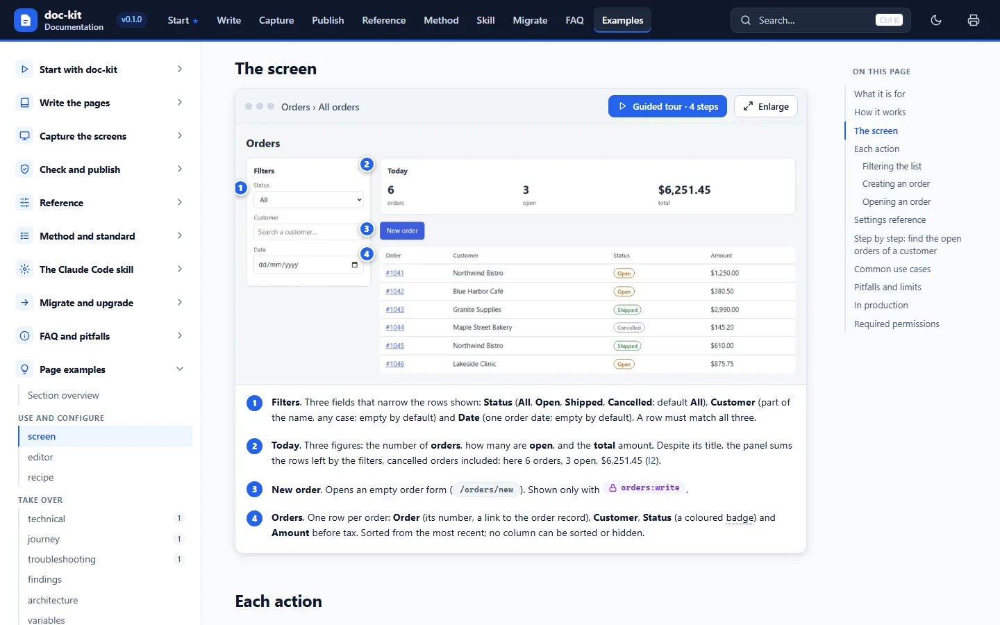
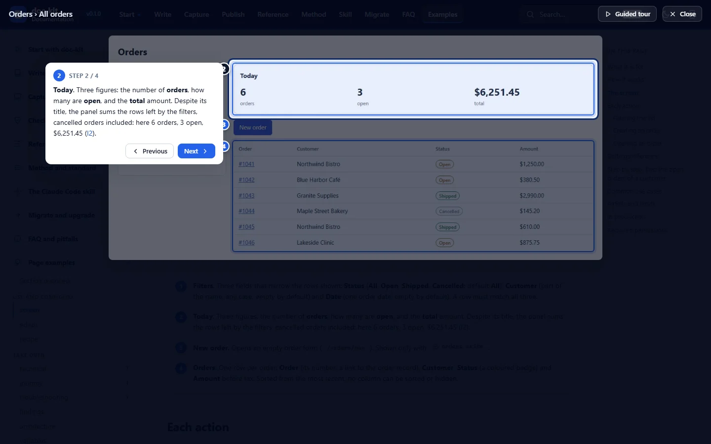

# doc-kit

**Product documentation as one self-contained HTML file.** doc-kit turns a web application into a documentation site
that opens offline in any browser: annotated screenshots with numbered markers, guided tours, full-text search, a
glossary, diagrams, light and dark themes, and printing of the whole site. You write Markdown, you describe the
screenshots in small capture plans, and the kit captures the screens **read-only**, measures the zones, builds the
site and checks it.

*[Version française](README.fr.md)*



## What you get

- **One HTML file**, `dist/<Product>-Documentation.html`: no server, no network, no installation for the reader.
  Send it, store it, attach it.
- **Annotated screenshots**: numbered markers placed on the real elements of the page, a legend, a **guided tour** that
  walks through them, a full-screen viewer, and a before / after slider.
- **Navigation**: sections, groups, sub-pages, breadcrumbs, previous / next links, reading paths on the home page,
  search with `Ctrl+K`, tooltips on the glossary terms, shareable addresses down to a section.
- **Light and dark themes**, diagrams included; **print** one page or the whole documentation, ready to save as PDF.
- **A quality standard** with 13 page templates, checks that block a broken site (strict build, links, legends,
  coverage of the application's routes, secrets), and an **audit** that measures the maturity of the site (levels 1
  to 4) and lists what to do next.
- **Safe captures**: read-only with a session, forbidden routes never opened, automatic masking of GUIDs and of the
  application's `.env` values.
- **English and French** everywhere: the site, the templates, the messages, the standard and this documentation.



## Quick start

```bash
npm install -g <kit folder>       # or: npm link in the kit's folder (see Install)
doc-kit init ../my-app            # detects the framework, asks the product name, language, URL, capture mode and sign-in; shows a recap
doc-kit connect                   # opens Chromium on the app: you sign in (SSO and MFA work), then press Enter
doc-kit capture                   # takes the example capture, read-only
doc-kit dev                       # opens the site with live reload
```

`init` creates `../my-app/docs/manual/`; run `npm install` there before `connect` (`init` prints the exact
commands). At any time, `doc-kit` without a command starts a **guided mode** that detects where you are and offers
the next step.

No application at hand? The kit ships a fictional one, **Acme Orders**: `node examples/demo-app/serve.mjs` serves it
on `http://127.0.0.1:4173` and accepts any e-mail and password. The documentation walks you through it in
[the first five minutes](docs/en/content/start/first-five-minutes.md).

## Requirements

- **Node.js 20 or later**, with npm, on Windows, macOS or Linux. Paths with spaces are fine.
- **Chromium for Playwright**, used to capture the screens, measure the tables and screenshot the site:
  `npx playwright install chromium` (add `--with-deps` on a Linux machine without a desktop). About 300 MB.
- Two runtime dependencies only: `marked` and `playwright`.

## Install

| Way | Commands | When |
|---|---|---|
| Clone and link | `git clone <repository URL> doc-kit`, `cd doc-kit`, `npm ci`, `npx playwright install chromium`, `npm link` | Your own machine: `doc-kit` answers everywhere |
| Without a global install | `npx --prefix <kit folder> doc-kit <command>` | A shared machine, a script, a first try |
| Plain Node | `node <kit folder>/cli/doc-kit.mjs <command>` | Before a project exists |

Each documentation project then depends on the kit through `"doc-kit": "file:<relative path to the kit>"` in its
`package.json` (written by `doc-kit init`), so `npx doc-kit` inside the project always runs the kit it was built
with. `doc-kit doctor` checks the whole installation and prints the fix of every problem.

## Repository layout

```text
doc-kit/
├─ cli/                 the doc-kit command: dispatcher and one module per command
├─ engine/              build, capture, checks, audit, dev server, site template, theme, i18n, migrations
├─ adapters/            coverage adapters (Next.js, React Router, i18n registry, glob) and sign-in adapters
├─ i18n/                every text of the kit, in English and in French
├─ schemas/             JSON schemas of the configuration, table of contents, glossary, zones and capture plans
├─ standard/            the documentation standard (English and French) and templates.json
├─ templates/           the project skeleton written by `init`, and the 13 page templates (en, fr)
├─ skill/doc-kit/       the Claude Code skill, installed with `doc-kit skill install`
├─ examples/            Acme Orders: a fictional demo application and its documentation project
├─ docs/                the kit's own documentation, built with the kit (docs/en, docs/fr)
├─ ci/                  GitHub Actions and Azure Pipelines examples
└─ test/                unit, snapshot and end-to-end tests
```

A documentation project, as `doc-kit init` writes it:

```text
docs/manual/
├─ doc.config.mjs       the configuration (product, language, app URL, sign-in, capture, theme…)
├─ content/             toc.json, glossary.json, home.md, and one Markdown file per page
├─ captures/plans/      the capture plans (JavaScript modules exporting CAPTURES)
├─ images/              the captures (WebP) and their zones (zones/<id>.json)
├─ diagrams/            SVG diagrams that follow the theme
├─ theme/               the logo
├─ dist/                the built site (git-ignored)
└─ .doc-kit/            the session and the work files (git-ignored)
```

## Documentation

The full documentation is a doc-kit site, in English (`docs/en`) and in French (`docs/fr`). Build it and open it:

```bash
node cli/doc-kit.mjs build --project docs/en     # docs/en/dist/doc-kit-Documentation.html
node cli/doc-kit.mjs open --project docs/en
```

It covers installing, writing (extended Markdown, page templates, table of contents, glossary, diagrams),
capturing (plans, targets, zones, sessions, safety, masking), checking and publishing (build, checks, audit, export,
CI), the reference of every configuration key, command, option, variable and adapter, the method, the Claude Code
skill, migrating a legacy project, and troubleshooting. Its **Page examples** section holds one complete page of each
of the 13 types.

The quality standard behind the kit is in [standard/README.md](standard/README.md) (French:
[standard/README.fr.md](standard/README.fr.md)). The interface contract of the kit is
[ARCHITECTURE.md](ARCHITECTURE.md).

## Contributing

Contributions are welcome: read [CONTRIBUTING.md](CONTRIBUTING.md) first (development setup, tests, the contract-first
rule, product neutrality, translations). This project follows a [code of conduct](CODE_OF_CONDUCT.md). To report a
vulnerability, see [SECURITY.md](SECURITY.md). Changes are listed in [CHANGELOG.md](CHANGELOG.md).

## License

[MIT](LICENSE).
